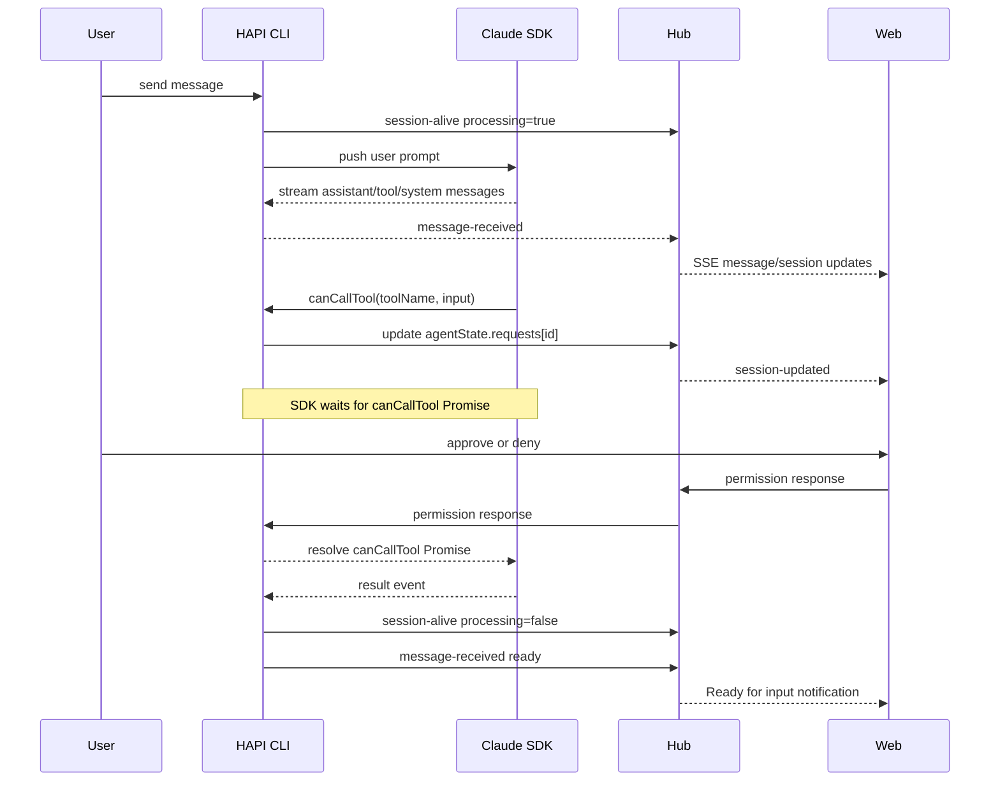
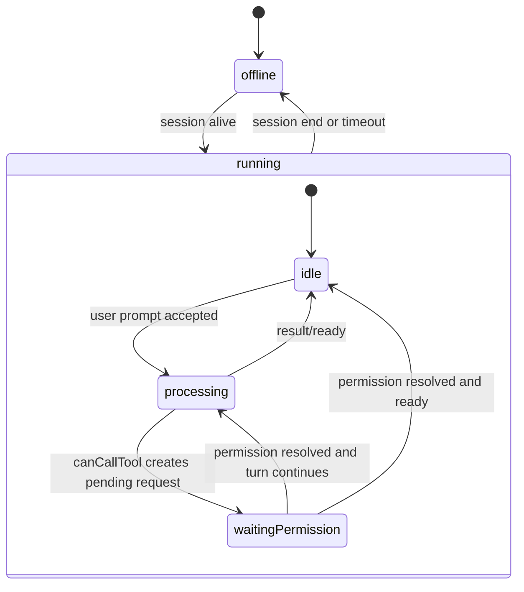
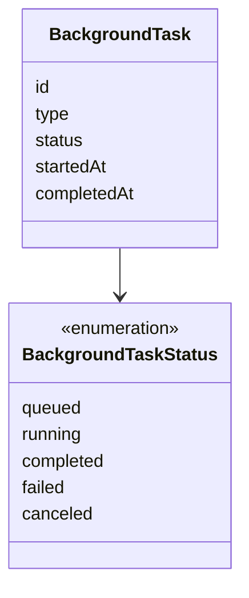

# Session State Model

## Principle

Notifications are only for main-agent interaction points. Background work is visibility, not interruption.

All foreground status, row indicators, stop-button enablement, and notification triggers must be derived from one state center. The state center owns the state machine, compares previous and next state, and emits transition events. Consumers register handlers for those events instead of re-deriving transitions locally.

## State Axes

The session state is modeled as two primary axes:

- Connection: `offline` | `running`
- Main agent: `idle` | `processing` | `waitingPermission`

Background activity is tracked separately as a list of per-task states and must not change the meaning of main-agent interaction states.

`processing` replaces the legacy `thinking` field name. It means the main agent has a turn in flight; it does not mean the model is emitting reasoning/thinking content.

## Claude SDK Data Flow

Claude SDK does not provide a single session status callback. HAPI derives session state from SDK callbacks and stream events.



Main-agent state is derived in priority order:

```ts
if (!session.active) return 'offline'
if (hasPendingPermissionRequests(session)) return 'waitingPermission'
if (session.processing) return 'processing'
return 'idle'
```

Today, `session.processing` is represented by the legacy `session.thinking` field sent through `session-alive`.

## State Transitions



The state center emits events from these transitions:

| Transition | Event | Consumer examples |
| --- | --- | --- |
| `processing` or `waitingPermission` -> `idle` | `readyForInput` | browser notification, voice ready event, in-app ready toast |
| any non-`waitingPermission` state -> `waitingPermission` | `permissionRequired` | permission attention UI, optional notification |

SSE, cache updates, and component props are transport. They may carry raw fields such as the legacy `thinking` flag, but they must not own status semantics or notification rules.

Background activity is a task list:



## Notification Rules

- Notify when the main agent becomes ready for input.
- Notify when the main agent needs user permission.
- Do not notify for background task start or completion by default.

## Foreground Display Rules

The composer status represents the main agent only:

- `offline`: session is not connected.
- `idle`: main agent can accept input.
- `processing`: main agent has a turn in flight.
- `waitingPermission`: main agent is blocked on user approval.

Background tasks must not replace the composer status text. They are visible in background task details and indicators.

The session list activity indicator follows the same main-agent state:

- Show a spinner for `processing`.
- Show an attention indicator for `waitingPermission`.
- Show no main activity indicator for `idle`.
- Dim the row for `offline`.

The stop control is enabled when there is anything interruptible:

- main agent is `processing`
- main agent is `waitingPermission`
- any background task is running
